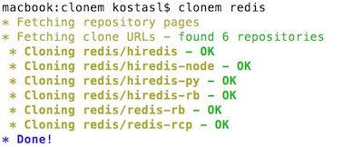

# clonem


Clone (or update) all repositories belonging to user or organization.

## Features

* Automatically download all repositories of user/organization
* Stop current clone/updates operation (e.g. for large repository) with Ctrl-C and   move on to the next one
* Update cloned repositories

## Prerequisites

* ```git```

## Install

```
$ npm install -g clonem
```

## Usage

```
$ clonem

  Usage: clonem [options] [user|organization]

  Options:

    -h, --help           output usage information
    -V, --version        output the version number
    -u, --update         Update (git pull) cloned repositories of user/organization
    --no-fork            Ignore forked repositories
    -v, --verbose        Print git messages
    -t, --token <token>  Save Github personal API token
```

## Example



## Licence

Copyright (c) 2015 [Kostas Lekkas](https://lekkas.io)

The project is licensed under the MIT license.
